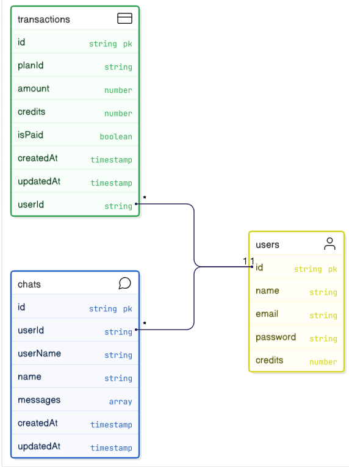

# AI GPT Base

This is a full-stack AI Chatbot Application built using the MERN stack (MongoDB, Express.js, React.js, and Node.js). The application allows users to **sign up, generate text content and images using AI, and purchase credits via an online payment gateway**. The project is divided into two main parts: **Frontend** (located in the `client` directory) and **Backend** (located in the `server` directory). Environment variables are configured in the `.env-example` file.

<a href="https://ai-gpt-base-sxidsvit.vercel.app/" target="_blank" >Site</a>

---

## Table of Contents

- [Features](#features)
- [Tech Stack](#tech-stack)
- [Frontend](#frontend)
- [Backend](#backend)
- [Installation](#installation)
- [Environment Variables](#environment-variables)
- [Usage](#usage)
- [Deployment](#deployment)
- [Contact](#contact)

## Features

- **User Authentication**: Users can sign up and log in to access the chatbot functionalities.
- **AI-Powered Text Generation**: Generate text content using the Google Gemini AI model.
- **AI-Powered Image Generation**: Create images from text prompts using ImageKit.
- **Online Payment Gateway**: Purchase credits to use AI features via a secure payment system.
- **Responsive Design**: A modern, user-friendly interface accessible on multiple devices.
- **Scalable Backend**: Built with Node.js and Express.js for robust API handling.
- **Database Integration**: MongoDB for storing user data and generated content.

## Tech Stack

- **Frontend**:

  - [React](https://reactjs.org/) - A JavaScript library for building dynamic, component-based user interfaces.
  - [Vite](https://vitejs.dev/) - A fast build tool and development server for modern web projects.
  - [Open AI React Package](https://www.npmjs.com/package/openai) - A package for integrating AI models with React applications.

- **Backend**:

  - [Node.js](https://nodejs.org/) - A JavaScript runtime for building scalable server-side applications.
  - [Express.js](https://expressjs.com/) - A minimal and flexible Node.js web application framework.
  - [MongoDB](https://www.mongodb.com/) - A NoSQL database for storing user data and application content.

- **AI Integration**:

  - [Google Gemini AI](https://ai.google.dev/) - A powerful AI model for text generation.
  - [ImageKit](https://imagekit.io/) - A service for AI-powered image generation and optimization.

- **Payment Processing**:
  - Online payment gateway (specific provider to be configured, e.g., Stripe or PayPal, based on implementation).

---


---

## Frontend

The frontend is located in the `client` directory and is built using **React** with **Vite** as the build tool. It provides a responsive and intuitive user interface for interacting with the AI chatbot. Key features include:

- **User Authentication**: Sign-up and login forms integrated with the backend.
- **Text Generation Interface**: A clean interface for users to input prompts and receive AI-generated text.
- **Image Generation**: A feature to generate images from text prompts using ImageKit.
- **Payment Integration**: A seamless UI for purchasing credits to access premium AI features.
- **Responsive Design**: Optimized for mobile, tablet, and desktop devices.

To run the frontend locally:

1. Navigate to the `client` directory: `cd client`
2. Install dependencies: `npm install`
3. Start the development server: `npm run dev`

The frontend communicates with the backend via RESTful APIs and uses the Open AI React package for seamless AI model integration.

## Backend

The backend is located in the `server` directory and is built using **Node.js**, **Express.js**, and **MongoDB**. It handles API requests, user authentication, AI model integration, and payment processing. Key features include:

- **RESTful APIs**: Endpoints for user management, text generation, image generation, and payment processing.
- **MongoDB Integration**: Stores user data, generated content, and transaction history.
- **Google Gemini AI**: Handles text generation requests using the Google Gemini AI model.
- **ImageKit Integration**: Processes image generation requests based on user prompts.
- **Secure Payment Gateway**: Integrates with an online payment provider for credit purchases.



To run the backend locally:

1. Navigate to the `server` directory: `cd server`
2. Install dependencies: `npm install`
3. Set up environment variables (see [Environment Variables](#environment-variables)).
4. Start the server: `npm run start`

## Installation

### Prerequisites

Ensure you have the following installed:

- [Node.js](https://nodejs.org/) (v16 or higher)
- [npm](https://www.npmjs.com/) (v7 or higher)
- [MongoDB](https://www.mongodb.com/) (local or cloud instance, e.g., MongoDB Atlas)
- [Git](https://git-scm.com/)

### Steps

1. **Clone the Repository**:

   ```bash
   git clone https://github.com/sxidsvit/ai-gpt-base.git
   cd ai-gpt-base
   ```

2. **Set Up the Frontend**:

   ```bash
   cd client
   npm install
   npm run dev
   ```

3. **Set Up the Backend**:

   ```bash
   cd server
   npm install
   npm run start
   ```

4. **Set Up MongoDB**:

   - Ensure MongoDB is running locally or configure a cloud instance (e.g., MongoDB Atlas).
   - Update the MongoDB connection string in the `.env` file (see [Environment Variables](#environment-variables)).

5. **Access the Application**:
   - Frontend: Open `http://localhost:5173` in your browser (default Vite port).
   - Backend: APIs are available at `http://localhost:5000` (or the configured port).

## Environment Variables

Environment variables are defined in the `.env-example` file. Create a `.env` file in both the `client` and `server` directories by copying `.env-example` and updating the values as needed.

### Example `.env` for Frontend (`client/.env`):

```env
VITE_SERVER_URL = your_*
```

### Example `.env` for Backend (`server/.env`):

```env
JWT_SECRET = your_*
MONGODB_URI = your_*
GEMINI_API_KEY = your_*
IMAGEKIT_URL_ENDPOINT = your_*
IMAGEKIT_PUBLIC_KEY = your_*
IMAGEKIT_PRIVATE_KEY = your_*
STRIPE_PUBLISHABLE_KEY = your_*
STRIPE_SECRET_KEY = your_*
STRIPE_WEBHOOK_SECRET = your_*
```

Replace placeholder values (`your_*`) with actual credentials from the respective services.

## Usage

1. **Sign Up / Log In**: Create an account or log in using the frontend interface.
2. **Generate Text**: Input a prompt in the text generation section to receive AI-generated content powered by Google Gemini AI.
3. **Generate Images**: Enter a prompt in the image generation section to create images using ImageKit.
4. **Purchase Credits**: Use the payment gateway to buy credits for accessing premium AI features.
5. **Review Content**: View and manage generated text and images in the user dashboard.

## Deployment

To deploy the application online:

1. **Frontend**:
   - Build the frontend: `cd client && npm run build`
   - Deploy the `dist` folder to a static hosting service (e.g., Vercel, Netlify).
2. **Backend**:
   - Deploy the backend to a Node.js-compatible platform (e.g., Heroku, Render).
   - Ensure MongoDB is accessible (e.g., via MongoDB Atlas).
3. **Environment Variables**: Configure the same environment variables used locally on your deployment platform.
4. **Payment Gateway**: Set up a production-ready payment gateway (e.g., Stripe, PayPal) and update the backend `.env` file.
5. **Domain Configuration**: Point your domain to the deployed frontend and backend services.

### Contact

Connect with the project maintainer:

[][linkedin]

[linkedin]: https://www.linkedin.com/in/sergiy-antonyuk/

#### 🙏 Acknowledgements

Special thanks to [GreatStack's YouTube Channel](https://www.youtube.com/@GreatStackDev) for his invaluable contributions.
